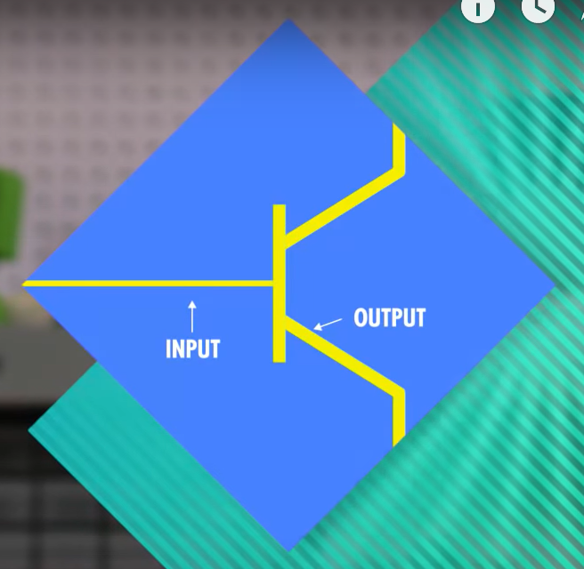
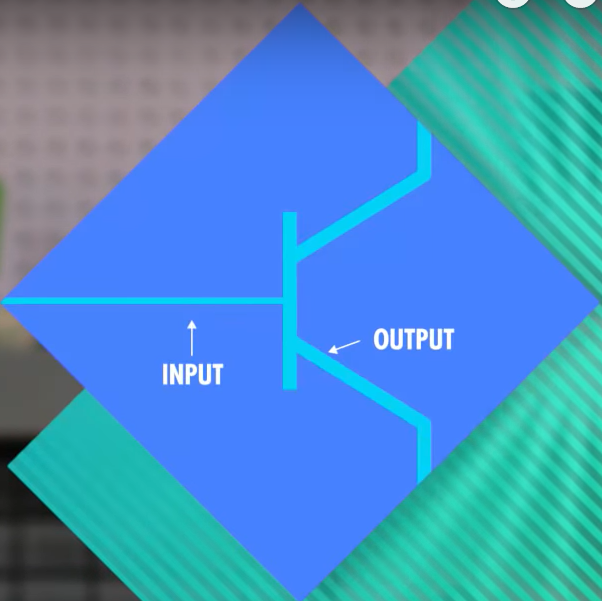
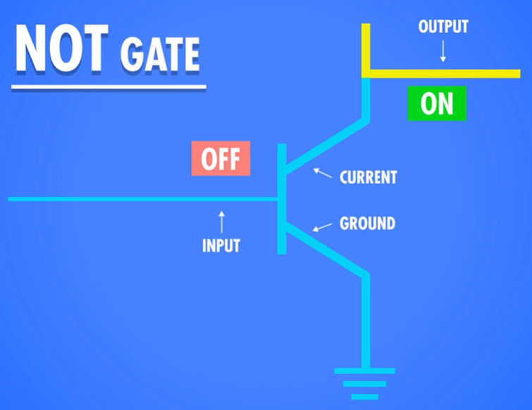
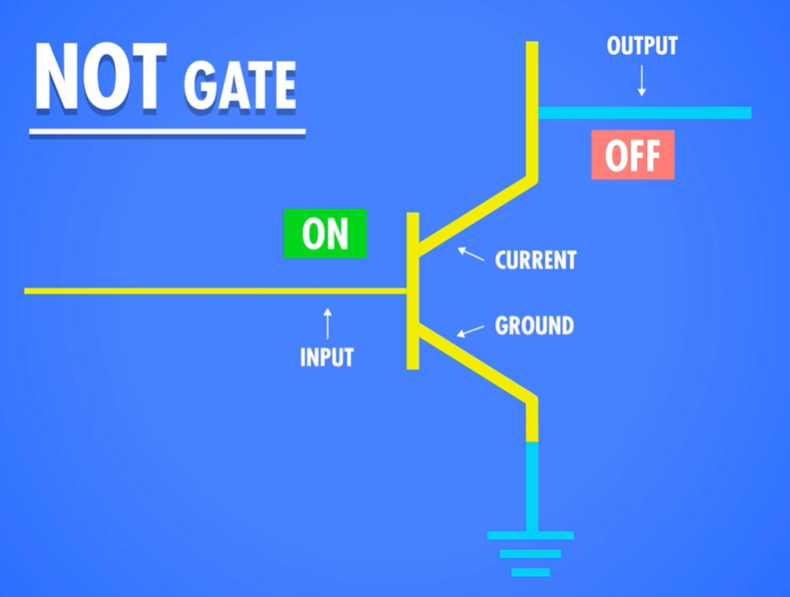
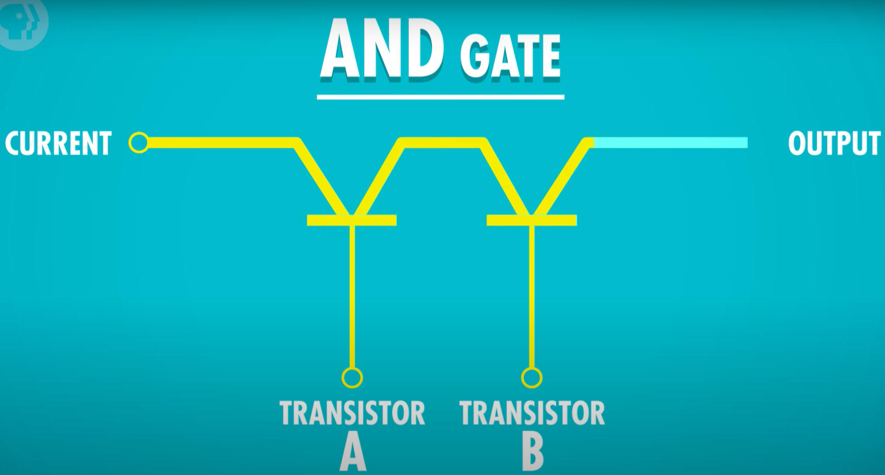

## Boolean Circuits

- BOOLEAN:
    - The first value that a trasistor can represent is the true and false.
    - A transistor with the input(I) output(O) gate_switch(S) can represent a boolean value using the following expression:
        - TRUE: If the gate_switch(S) is on it allows the current to flow from the input to the output gate.
        -   
        - FALSE: If the gate_switch(S) is off it dont allows the current to flow from the input to the output gate.
        -   

- NOT:
    - 
    - A way to represent the inverse value of a BOOLEAN.
    - To perform a not operation we place the output connected to the input of the transistor and the other leg of the
      transistor connected to the ground(G).
    - NOT over a FALSE: When the gate_switch(S) is off the output is true because the ground(G) isn't flowing any current.
      So the current flow trouh the output pin.
      
    - 
    - NOT over a TRUE: When the gate_switch(S) is on the output is false because the hole eletricity is flowing to the ground(G).
      So the output(O) receives the lowest current value.

- AND: 
    - 
    - Only if the two inputs are true the output is true.
    - If one of the inputs are false then output is false because the current wont flow.